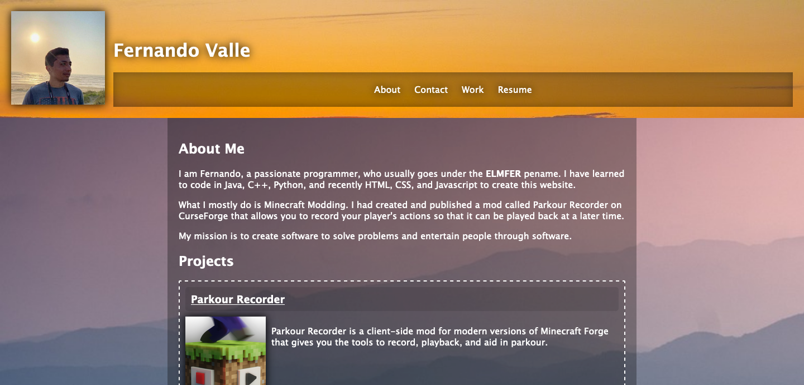

# Portfolio Website
Portfolio Website using advanced css. It houses my list of projects for an employer to see, and it contains my contact info in case they want to reach out.

View it here: [https://elmfer.github.io/challenge-02/](https://elmfer.github.io/challenge-02/)

### What I Learned
* Flexboxes, specifically on how they structure and align elements responsively.
* CSS Variables. I found that they are useful for when a certain values are referenced multiple times in a style sheet. They can be quickly changed and affect all styling using it without having to find and replace.

And tiny things like:
* The `background-image` CSS property for image backgrounds.
* `box-shadow` with the `inset` parameter for inner box shadows
* `list-style` for removing the default bullet points to show a list of links on the nav bar.

### Screenshot

---

### Credits
* Stock photos aquired from Pixabay
* University of Toronto for the placeholder image.
